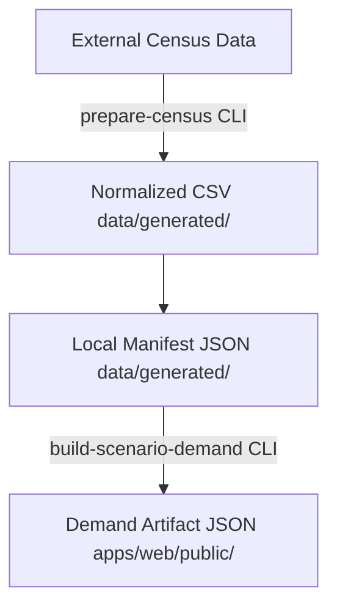

# Census Grid Source-Material Preparation Manual

This guide describes the repository-local tooling path for importing real-world census datasets into OpenVayra - Cities scenario demand configurations.

## Scope and Objectives

The baseline application fixtures distribute residential coverage using artificial/synthetic distributions. For higher fidelity scenarios, developers can consume structured population density models.

> [!IMPORTANT]
> OpenVayra - Cities remains focused on lightweight simulation slices rather than absolute real-world urban reconstruction workflows.

## Execution Lifecycle

Raw spatial formats pass through multi-stage pipeline constraints:



1. **Raw Source Material:** Non-committed local datasets (typically GIS downloads).
2. **Normalized Local Source Material:** Bounds-restricted WGS84 CSV targets (`grid_id,lng,lat,population`).
3. **Generated Local Manifest:** Intermediary configuration combining spatial components.
4. **Final Runtime Demand Artifact:** Consolidated static payload executed by web adapters.

---

## Available Data Sources

* **Eurostat GISCO Population Grids:** Harmonized 1 km grid cells for EU member states.
* **German Zensus 2022:** Official high-density structural demographics mapped to standardized projections.

*Users assume responsibility for verifying applicable data licenses and attribution rules.*

## Handling Coordinate Reference Systems (CRS)

Large demographic models map to standard equal-area grids (such as **ETRS89-LAEA / EPSG:3035**), but the runtime expects raw **WGS84 Longitude/Latitude (EPSG:4326)**.

The preparation pipeline translates projections via embedded `proj4` dependencies.

---

## Execution Commands

### 1. Census Grid Normalization

Map local grid extractions toward target scenarios:

```bash
pnpm scenario-demand:prepare-census:hamburg-core-mvp
```

*Default Options supported dynamically:*
* `--input-crs epsg:3035` (Converts projected metrics to WGS84)
* `--id-column`
* `--population-column`
* `--longitude-column`
* `--latitude-column`
* `--delimiter`

### 2. Artifact Generation

Compile processed grids into client bundles:

```bash
pnpm scenario-demand:build:hamburg-core-mvp:local-census
```
